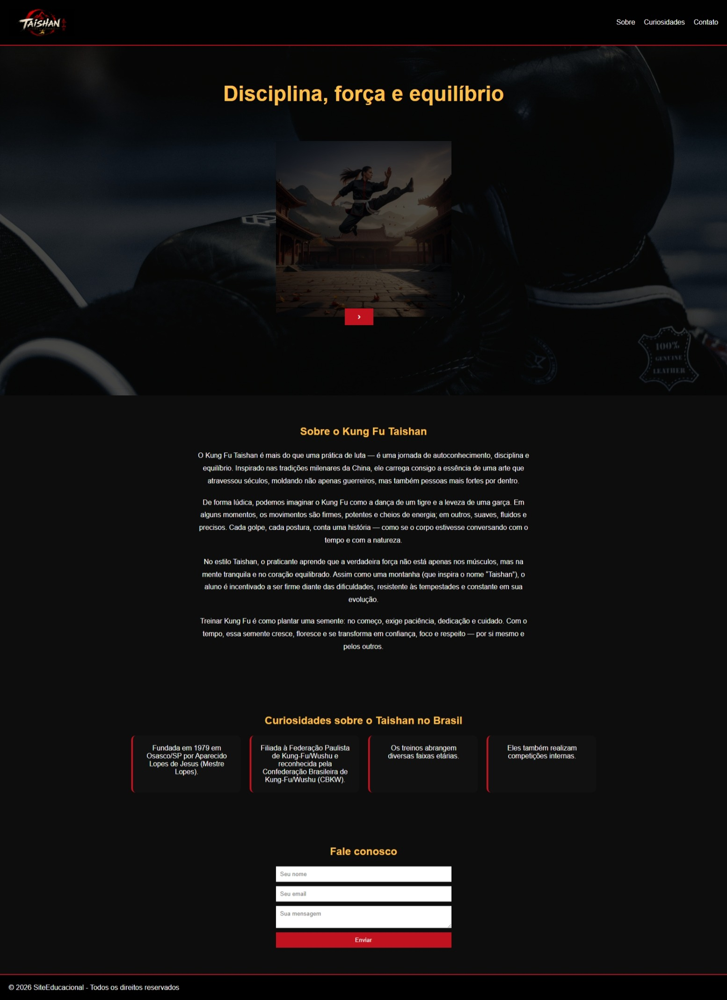

# 🚀 Landing Page - Kung Fu Taishan


Landing page desenvolvida utilizando HTML5, CSS3 e JavaScript, com foco em responsividade, interatividade e organização semântica do código.


## 🎨 Layout
O design foi inspirado na estética marcial, utilizando cores como:
- Preto (força e disciplina)
- Vermelho (energia e poder)
- Dourado (tradição e excelência)


---

## 📋 Índice

- [Sobre](#sobre)
- [Demo](#demo)
- [Funcionalidades](#funcionalidades)
- [Tecnologias](#tecnologias)
- [Estrutura do Projeto](#estrutura-do-projeto)
- [Como Usar](#como-usar)
- [Autora](#Desenvolvido por)
- [Contato](#contato)

---

## 📖 Sobre

O projeto simula o site institucional de uma academia de Kung Fu Taishan no Brasil, contendo:

Estrutura semântica de páginas
Estilização moderna com CSS
Componentes interativos (carrossel de imagens)
Layout responsivo para diferentes dispositivos

O desenvolvimento teve como objetivo consolidar conhecimentos em front-end, boas práticas de código e construção de interfaces visuais atrativas.

---

## 🌐 Demo

🔗 **[Ver Demo ao Vivo](https://seuusuario.github.io/nome-do-repositorio/)**

---

## ✨ Funcionalidades

- [x] Design responsivo (Mobile, Tablet, Desktop)
- [x] Layout moderno e atrativo
- [x] Navegação suave (smooth scroll)
- [x] Seção Hero com CTA
- [x] Seção de serviços/recursos
- [x] Formulário de contato
- [x] Footer com links e redes sociais


---

## 🛠️ Tecnologias

| Tecnologia | Uso |
|------------|-----|
| **HTML5**  | Estrutura e semântica |
| **CSS3**   | Estilização e responsividade |
| **JavaScript** | Componentes interativos (carrossel de imagens) |

---


## 📁 Estrutura do Projeto

/KungFULandingPage
├── index.html
├── style.css
└── assets/
    └── img/
        ├── kungFuLogo.png
        ├── foto1.jpg
        ├── foto2.jpg
        ├── foto3.jpg
        ├── foto4.jpg
        ├── foto5.jpg
        ├── foto9.jpg
        └── preview.jpeg
└── 📄 README.md        

---

## 🚀 Como Usar

### Pré-requisitos

- Navegador web atualizado (Chrome, Firefox, Edge, Safari)
- Editor de código (VS Code recomendado)

### Instalação

1. Clone o repositório:
   ```bash
   git clone https://github.com/seuusuario/nome-do-repositorio.git

   cd nome-do-repositorio
   
# Com VS Code + Live Server
code .
# Ou simplesmente abra o index.html no navegador


## 👩‍💻 Autora
Desenvolvido por **Adriana Medeiros Rodrigues**

---

## 📬 Contato

- 💼 LinkedIn: www.linkedin.com/in/adriana-medeiros-ti 
- 💻 GitHub: https://github.com/TechCodeDri 


